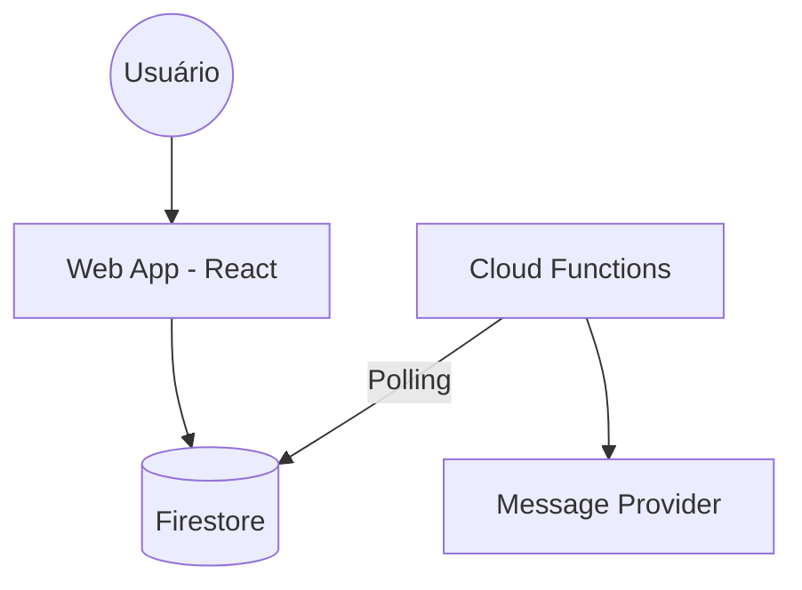

# Broadcast

Plataforma SaaS para agendamento e gestão de mensagens em massa. O sistema permite o controle de multi-tenants, gestão de conexões e contatos, com agendadores automáticos via Cloud Functions.

## Tech Stack

- React (Vite)
- TypeScript
- Material UI (MUI) / Tailwind CSS
- Firebase (Auth, Firestore)
- Firebase Cloud Functions (Node.js 22)

## Arquitetura

O projeto utiliza uma arquitetura baseada em eventos e agendamento:



## Instalação

O projeto é dividido entre o frontend (`web/`) e as funções de backend (`functions/`).

```bash
# Frontend
cd web
npm install

# Functions
cd functions
npm install
```

## Execução

### Frontend

```bash
cd web
npm run dev
```

### Functions (Emulator)

```bash
cd functions
npm run serve
```

## Estrutura do Projeto

### Web (`web/src/app`)

- `components/` Componentes de interface e dashboard.
- `context/` Gerenciamento de estado global (Auth).
- `hooks/` Hooks customizados para Firestore e dados.
- `layout/` Estrutura de casca da aplicação (Shell, Nav).
- `pages/` Telas principais (Messages, Contacts, Connections).
- `services/` Lógica de comunicação com Firebase.
- `lib/` Configurações base (Firebase, Theme).

### Functions (`functions/src`)

- `scheduledMessages.ts` Worker para processamento de mensagens agendadas.
- `firebaseAdmin.ts` Configuração do SDK Admin.

## Observações

As configurações de ambiente do Firebase devem estar em `web/src/app/lib/firebase.ts`.
